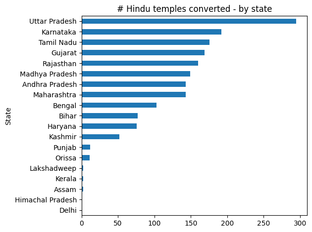
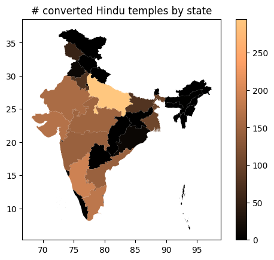

#### || Shree Ganeshay Namah || 
  
  
# Converted Hindu Temples
A list of Hindu temples that have been converted or modified or used to build Islamic structures

#### Source of data: Hindu Temples What Happened To Them by Sitaram Goel

#### Steps:
1. Used Tabula to scrape data from pages containing list of Hindu temples. Output is a CSV file containing text data.
2. Used Python to extract and split information in each data row. Output is a table containing details on state, district, city, temple and change.
3. Finally, checked data manually and made manual edits to get the final result.

#### Please suggest any edits or corrections by writing to vindicindic@gmail.com
